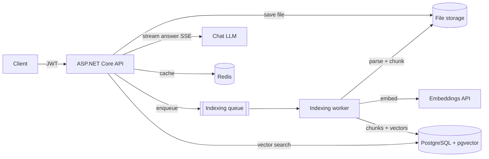

# AskMyArchive

Ask questions about your own documents — in plain language.

Upload contracts, receipts, manuals or notes (PDF, DOCX, TXT, MD), and AskMyArchive parses,
chunks and embeds them into PostgreSQL + pgvector. Then ask *"When does the fridge warranty
expire?"* and get a streamed answer with citations pointing to the exact file and page.

## Architecture



**Ask pipeline:** embed the question → cosine search over the user's chunks (pgvector) →
build a grounded prompt → stream the answer token-by-token via server-sent events,
with source citations sent up front.

**Indexing pipeline:** upload → background worker parses (PdfPig / OpenXML) → sliding-window
chunking with overlap → batch embeddings → vectors stored in Postgres. Failures mark the
document `Failed` with the error instead of crashing the worker; unfinished documents are
re-queued on startup.

## Project layout

| Project | Responsibility |
|---|---|
| `AskMyArchive.Core` | Entities, abstractions, chunking and RAG orchestration — no infrastructure dependencies |
| `AskMyArchive.Infrastructure` | EF Core + pgvector, Redis cache, LLM clients, parsers, background worker |
| `AskMyArchive.Api` | Minimal API endpoints, JWT auth, SSE streaming, Scalar API docs |
| `AskMyArchive.UnitTests` | Pure logic tests (chunker, prompt builder) |
| `AskMyArchive.IntegrationTests` | Real Postgres via Testcontainers (vector search, user isolation) |

## Quick start

```bash
# chat via DeepSeek, embeddings via OpenAI
CHAT_API_KEY=sk-deepseek... EMBEDDINGS_API_KEY=sk-openai... docker compose up --build
```

Open http://localhost:8080/scalar/v1 for interactive API docs.

Everything LLM-related is **provider-agnostic**: any OpenAI-compatible endpoint works.
For a fully local setup, point embeddings (and chat) at [Ollama](https://ollama.com):

```bash
EMBEDDINGS_BASE_URL=http://host.docker.internal:11434/v1 \
EMBEDDINGS_MODEL=nomic-embed-text EMBEDDINGS_DIMENSIONS=768 \
CHAT_API_KEY=sk-... docker compose up --build
```

> The pgvector column dimension must match the embedding model
> (`text-embedding-3-small` = 1536, `nomic-embed-text` = 768). Changing the model
> means re-indexing.

## API

| Method | Route | Description |
|---|---|---|
| POST | `/api/auth/register` | Create an account |
| POST | `/api/auth/login` | Get a JWT |
| POST | `/api/documents` | Upload a file (multipart), returns `202 Accepted` |
| GET | `/api/documents` | List documents with indexing status |
| DELETE | `/api/documents/{id}` | Delete a document and its chunks |
| POST | `/api/ask` | Ask a question — SSE stream: `meta` (sources) → `token`* → `done` |
| GET | `/api/conversations` | List conversations |

See [api.http](api.http) for ready-to-run sample requests.

## Tests

```bash
dotnet test                          # unit tests
RUN_INTEGRATION_TESTS=1 dotnet test  # + integration tests (needs Docker)
```

## Roadmap

- [ ] EF Core migrations instead of `EnsureCreated`
- [ ] HNSW index on the vector column for large archives
- [ ] XLSX parser (port from ClosedXML-based reader)
- [ ] Extract the indexing worker into a separate service behind RabbitMQ
- [ ] Hybrid search (vector + full-text) with reranking
- [ ] Minimal web UI
- [ ] Rate limiting and refresh tokens
