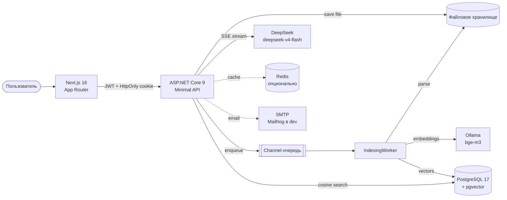

<div align="center">

# AskMyArchive

**RAG-сервис, который отвечает на вопросы по твоим документам — со ссылками на источник.**

Загрузи PDF, DOCX, XLSX, TXT, MD или картинку — и задай вопрос на естественном языке. AskMyArchive найдёт нужные фрагменты, соберёт ответ и покажет, из какого файла и с какой страницы взята каждая цитата.

[](https://github.com/sikorskiy50205/AskMyArchive/actions/workflows/ci.yml)


</div>

<!--
  ВИДЕО-ДЕМО (60–90 сек)
  1. Перетащи готовый MP4 в комментарий любого issue/PR этого репозитория.
  2. GitHub выдаст ссылку вида https://github.com/user-attachments/assets/<uuid>.
  3. Замени строку ниже на:  https://github.com/user-attachments/assets/<uuid>
-->

> 🎬 **Демо-видео появится здесь** — короткая запись экрана: загрузка документа → индексирование → вопрос → потоковый ответ с цитатами.

---

## Оглавление

- [Что это](#что-это)
- [Скриншоты](#скриншоты)
- [Возможности](#возможности)
- [Архитектура](#архитектура)
- [Технически интересное](#технически-интересное)
- [Локальный запуск](#локальный-запуск)
- [Тесты и CI](#тесты-и-ci)
- [Roadmap](#roadmap)
- [Лицензия](#лицензия)

---

## Что это

Дома и на работе накапливаются десятки PDF-договоров, инструкций, отчётов, скан-копий. Поиск по имени файла бесполезен, а Ctrl+F внутри 200-страничного PDF — тем более. AskMyArchive решает это так:

1. **Разбирает документ** — извлекает текст (PDF через PdfPig, DOCX через OpenXML, XLSX через ClosedXML, картинки через Tesseract.js в браузере).
2. **Режет на семантические чанки** — с перекрытием, чтобы не терять контекст на границах.
3. **Считает векторные эмбеддинги** и складывает их в PostgreSQL с расширением pgvector.
4. **На вопрос** — эмбеддит запрос, ищет ближайшие чанки cosine-метрикой, строит промпт с найденными фрагментами и стримит ответ LLM токенами через Server-Sent Events.
5. **Показывает цитаты** — под ответом кликабельные «пилюли» вида `Договор.pdf, стр. 5`, открывающие исходный документ прямо на этой странице.

Портфолио-проект, показывающий полный fullstack-цикл: backend на .NET, фронтенд на Next.js, векторный поиск, потоковая генерация, аутентификация с refresh-токенами, интеграция с Google OAuth и SMTP, OCR в браузере, i18n, тёмная тема и мобильная адаптация.

## Скриншоты

<!--
  СКРИНШОТЫ (по тому же принципу, что и видео: перетащи в issue-комментарий, вставь ссылку).
  Рекомендую 4–5 штук в тёмной теме:
    1. Список документов со статусами (Индексируется / Готов / Ошибка)
    2. Чат с потоковым ответом и цитатами
    3. Превью PDF с якорем на конкретной странице
    4. Модалка OCR: картинка + распознанный текст с прогрессом
    5. Мобильный вид (можно портретной ориентации, узкая колонка)
-->

| Документы | Чат с цитатами |
|---|---|
| _скриншот 1_ | _скриншот 2_ |

| Превью PDF | OCR картинок | Мобильный вид |
|---|---|---|
| _скриншот 3_ | _скриншот 4_ | _скриншот 5_ |

## Возможности

**Аутентификация**
- Регистрация / логин по email + пароль
- **Google Sign-In** через ID-token flow (Google Identity Services + `Google.Apis.Auth` на сервере, автосвязка с существующим email-аккаунтом по verified-email)
- **Refresh-токены в HttpOnly-cookie** с ротацией на каждом рефреше; access-JWT живёт 15 минут, refresh — 30 дней
- Подтверждение email по ссылке, «Забыли пароль?» → сброс через email
- Прозрачный рефреш на 401 через single-flight interceptor

**Документы**
- Drag & drop загрузка с progress-баром (XHR ради событий прогресса)
- Поддержка PDF, DOCX, XLSX, TXT, MD и изображений (PNG/JPG/WEBP через OCR)
- Live-статусы (Загружено / Индексируется / Готов / Ошибка) с автообновлением
- Фильтры по статусу и дате, массовое удаление, лимит хранилища на пользователя
- Встроенное превью: PDF-viewer с якорем на страницу, текстовый режим с поиском по документу (`Ctrl+F` внутри модалки)

**Чат**
- Диалоги в сайдбаре, переименование, удаление
- **Потоковый ответ** через SSE — токены появляются в реальном времени
- Markdown с подсветкой синтаксиса
- Цитаты-пилюли, ведущие в модалку с документом на нужной странице
- Copy / Regenerate / Stop generation
- Учёт контекста предыдущих сообщений

**UX**
- Русский и английский интерфейс (`next-intl`, переключение без перезагрузки)
- Светлая / тёмная тема (`next-themes` + `prefers-color-scheme`)
- Полная мобильная адаптация — сайдбар сворачивается в Sheet, чат используется одной рукой
- Хоткеи `Ctrl+K` (поиск по документам), `/` (новый чат)
- Тосты, скелетоны, аккуратные 404 / 500

## Архитектура



**Слои backend (Clean Architecture):**

| Проект | Ответственность |
|---|---|
| `AskMyArchive.Core` | Сущности домена, интерфейсы, `RagService`, чанкер, prompt-builder. Без зависимостей от инфраструктуры. |
| `AskMyArchive.Infrastructure` | EF Core + pgvector, Redis-декоратор для кеша, OpenAI-совместимые LLM-клиенты, парсеры (PdfPig / OpenXML / ClosedXML), `IndexingWorker` на `Channel<T>`, `SmtpEmailSender` на MailKit. |
| `AskMyArchive.Api` | Minimal API, JWT + refresh cookie, SSE-стриминг, Scalar/OpenAPI, CORS с `AllowCredentials`. |
| `frontend/` | Next.js 16 (App Router, TS, Turbopack), Tailwind 4, shadcn/ui, TanStack Query, Zustand, react-hook-form + zod. |

**Два основных pipeline'а:**

- **Индексация:** `upload → сохранить файл → поставить в Channel-очередь → parse → chunk с overlap → батч эмбеддингов → сохранить чанки+векторы`. Падение одного документа не роняет worker; недоиндексированные документы переставляются в очередь при старте.
- **Ответ на вопрос:** `эмбеддинг вопроса → cosine-поиск (максимум 2 чанка на документ, чтобы один большой файл не задушил выдачу) → grounded-промпт с цитатами → SSE-стрим ответа`.

## Технически интересное

Пара решений, которые не очевидны на первый взгляд:

- **Diversified retrieval.** Раньше один большой документ забивал весь top-K и другие файлы не попадали в контекст. Переписал `ChunkSearcher` на raw SQL с `ROW_NUMBER() OVER (PARTITION BY DocumentId)` — не больше 2 чанков от одного документа.
- **Выбор embedding-модели — по измерениям, а не по вере.** Стартовал на `nomic-embed-text`; на русских вопросах она ранжировала почти случайно (нужный документ оказывался на 9–10 месте из-за англоцентричности модели). Написал скрипт, воспроизводящий поиск на живой базе, сравнил ранжирование до/после и перешёл на многоязычную `bge-m3` — целевые чанки поднялись с «за бортом» на 1–2 место.
- **PDF в iframe с Bearer-токеном.** `<iframe>` не умеет отправлять заголовок `Authorization`. Решение: `fetch` PDF с заголовком, `URL.createObjectURL(blob)`, iframe указывает на blob-URL. Якорь на страницу — через фрагмент `#page=N` (PDF Open Parameters, работает в Chrome/Edge/Firefox). Никакого `pdf.js` в бандле.
- **OCR картинок в браузере.** Изображения не попадают в indexing-queue: приходят со статусом `AwaitingOcr`, фронт скачивает blob, запускает Tesseract.js WASM (rus+eng, ~2 МБ, динамический импорт), пользователь редактирует распознанный текст в модалке, `PUT /api/documents/{id}/ocr-text` уже штатно чанкует и эмбеддит. Сервер OCR не крутит.
- **Rotating refresh tokens.** `RefreshToken` хранится хешем (SHA-256), single-use ротация на каждом `/refresh`, при сбросе пароля отзываются все живые токены пользователя. На фронте — single-flight interceptor: параллельные 401 делят один `/refresh`.
- **No user enumeration.** `POST /api/auth/forgot-password` всегда возвращает 204, независимо от того, есть ли такой пользователь и есть ли у него пароль вообще (Google-only аккаунты — молчаливый no-op).
- **Google Sign-In без backend redirect.** ID-token flow: GIS выдаёт JWT на фронте, сервер валидирует через `Google.Apis.Auth`. Толерантность к разъезду часов 5 минут — без неё Windows со сбитым временем ловил «JWT is not yet valid».
- **Integration-тесты на реальном Postgres.** Testcontainers поднимает `pgvector/pgvector:pg17` под тесты — векторный поиск и изоляция пользователей проверяются на настоящей БД, а не на моках.

## Локальный запуск

### Вариант A — быстрый просмотр через Docker

```bash
git clone https://github.com/sikorskiy50205/AskMyArchive.git
cd AskMyArchive

# Ключ DeepSeek + любой OpenAI-совместимый ключ для эмбеддингов
CHAT_API_KEY=sk-deepseek-... \
EMBEDDINGS_API_KEY=sk-openai-... \
docker compose up --build
```

- API: http://localhost:8080 (Scalar-докой на `/scalar/v1`)
- Postgres: `localhost:5432` (askmyarchive / postgres / postgres)
- Mailhog (dev-inbox): http://localhost:8025

### Вариант B — полностью локальный dev

**Требуется:** .NET 9 SDK, Node.js 20+, Docker (только для Postgres), [Ollama](https://ollama.com) для эмбеддингов.

```bash
# 1. Postgres с pgvector
docker run -d --name askmyarchive-postgres \
  -e POSTGRES_DB=askmyarchive -e POSTGRES_USER=postgres -e POSTGRES_PASSWORD=postgres \
  -p 5432:5432 -v askmyarchive-pgdata:/var/lib/postgresql/data \
  pgvector/pgvector:pg17

# 2. Ollama и модель эмбеддингов
ollama pull bge-m3

# 3. Ключ DeepSeek — через user-secrets, не в appsettings.json
dotnet user-secrets set "Llm:Chat:ApiKey" "sk-deepseek-..." --project src/AskMyArchive.Api

# 4. API
dotnet run --project src/AskMyArchive.Api          # http://localhost:5014

# 5. Frontend (в отдельном терминале)
cd frontend
npm install
npm run dev                                        # http://localhost:3000
```

### Опциональные ключи

| Env / secret | Что | Где брать |
|---|---|---|
| `Llm:Chat:ApiKey` | Ключ DeepSeek для чат-модели | https://platform.deepseek.com |
| `GoogleAuth:ClientId` | Google OAuth Client ID (для Google Sign-In) | https://console.cloud.google.com |
| `NEXT_PUBLIC_GOOGLE_CLIENT_ID` | Тот же Client ID для фронта | `.env.local` во `frontend/` |
| `Email:Smtp*` | Реальный SMTP вместо Mailhog | по вкусу (Resend/SES/SendGrid) |

Смена embeddings-модели требует **пересоздания vector-колонки и переиндексации** — размерность фиксирована при миграции (`bge-m3` = 1024, `nomic-embed-text` = 768, `text-embedding-3-small` = 1536).

## Тесты и CI

```bash
dotnet test                              # unit-тесты (чанкер, prompt-builder)
RUN_INTEGRATION_TESTS=1 dotnet test      # + integration через Testcontainers (нужен Docker)
```

CI в GitHub Actions гоняет `dotnet build` + `dotnet test` (включая integration) на каждый push и PR в `main` — статус виден в бейдже в шапке.

## Roadmap

Осознанно отложено на «после портфолио»:

- **HNSW-индекс** на pgvector-колонке — актуален для архивов от ~50k чанков, для демо избыточен. Строится одним `CREATE INDEX ... USING hnsw (embedding vector_cosine_ops)`.
- **Объектное хранилище (MinIO / S3)** вместо локальной ФС.
- **Реальный SMTP-провайдер** — инфраструктура готова, нужен только swap Mailhog на Resend / SES.
- **Deploy** на Fly.io / Railway; Ollama придётся заменить на платный embeddings API (nomic-embed-text бесплатно, но требует своего инстанса).
- **Гибридный поиск** — вектор + full-text с реранкингом.
- **Разнесение IndexingWorker в отдельный сервис** за RabbitMQ — как отдельная демка микросервисов.

## Лицензия

MIT (планируется). Файл `LICENSE` будет добавлен вместе с публикацией демо-видео.

---

<div align="center">

Автор: **Igor Sikorskiy** · [GitHub](https://github.com/sikorskiy50205) · igoryok.891@gmail.com

</div>
