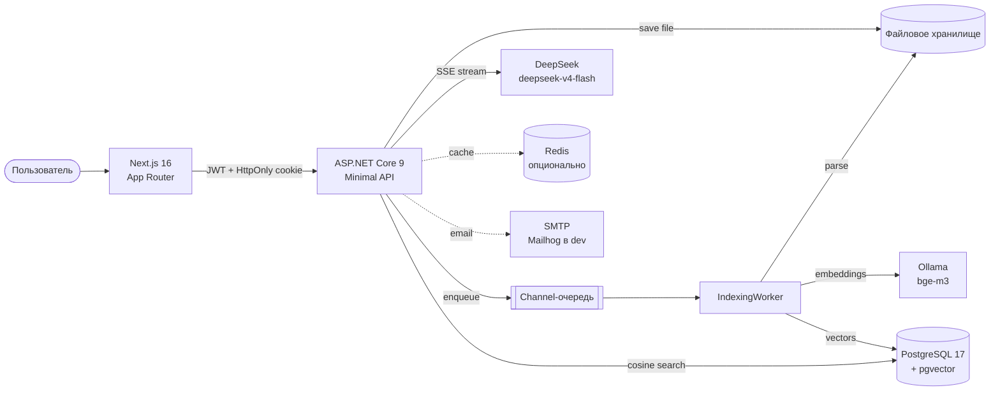

<div align="center">

# AskMyArchive

**RAG-сервис, который отвечает на вопросы по твоим документам — со ссылками на источник.**

Загрузи PDF, DOCX, XLSX, TXT, MD или картинку — и задай вопрос на естественном языке. AskMyArchive найдёт нужные фрагменты, соберёт ответ и покажет, из какого файла и с какой страницы взята каждая цитата.

[](https://github.com/sikorskiy50205/AskMyArchive/actions/workflows/ci.yml)


</div>

<video src="https://github.com/user-attachments/assets/a9d371bc-70db-4c3f-a32a-86ed35deb1c0" controls></video>

---

## Оглавление

- [Что это](#что-это)
- [Возможности](#возможности)
- [Архитектура](#архитектура)
- [Технически интересное](#технически-интересное)
- [Локальный запуск](#локальный-запуск)
- [Тесты и CI](#тесты-и-ci)
- [Границы демо-версии: безопасность](#границы-демо-версии-безопасность)
- [Roadmap](#roadmap)
- [Лицензия](#лицензия)

---

## Что это

Дома и на работе накапливаются десятки PDF-договоров, инструкций, отчётов, скан-копий. Поиск по имени файла бесполезен, а Ctrl+F внутри 200-страничного PDF — тем более. AskMyArchive решает это так:

1. **Разбирает документ** — извлекает текст (PDF через PdfPig, DOCX через OpenXML, XLSX через ClosedXML, картинки через Tesseract.js в браузере).
2. **Режет на семантические чанки** — с перекрытием, чтобы не терять контекст на границах.
3. **Считает векторные эмбеддинги** и складывает их в PostgreSQL с расширением pgvector.
4. **На вопрос** — эмбеддит запрос, ищет ближайшие чанки cosine-метрикой, строит промпт с найденными фрагментами и стримит ответ LLM токенами через Server-Sent Events.
5. **Показывает цитаты** — под ответом кликабельные «пилюли» вида `Договор.pdf, стр. 5`, открывающие исходный документ прямо на этой странице.

Портфолио-проект, показывающий полный fullstack-цикл: backend на .NET, фронтенд на Next.js, векторный поиск, потоковая генерация, аутентификация с refresh-токенами, интеграция с Google OAuth и SMTP, OCR в браузере, i18n, тёмная тема и мобильная адаптация.

## Возможности

**Аутентификация**
- Регистрация / логин по email + пароль
- **Google Sign-In** через ID-token flow (Google Identity Services + `Google.Apis.Auth` на сервере, автосвязка с существующим email-аккаунтом по verified-email)
- **Refresh-токены в HttpOnly-cookie** с ротацией на каждом рефреше; access-JWT живёт 15 минут, refresh — 30 дней
- Подтверждение email по ссылке, «Забыли пароль?» → сброс через email
- Прозрачный рефреш на 401 через single-flight interceptor
- Rate limiting: 5 попыток в минуту с одного IP на credential-эндпоинты — защита от перебора паролей

**Документы**
- Drag & drop загрузка с progress-баром (XHR ради событий прогресса)
- Поддержка PDF, DOCX, XLSX, TXT, MD и изображений (PNG/JPG/WEBP через OCR)
- Live-статусы (Загружено / Индексируется / Готов / Ошибка) с автообновлением
- Фильтры по статусу и дате, массовое удаление, лимит хранилища на пользователя
- Встроенное превью: PDF-viewer с якорем на страницу, текстовый режим с поиском по документу (`Ctrl+F` внутри модалки)

**Чат**
- Диалоги в сайдбаре, переименование, удаление
- **Потоковый ответ** через SSE — токены появляются в реальном времени
- Markdown с подсветкой синтаксиса
- Цитаты-пилюли, ведущие в модалку с документом на нужной странице
- Copy / Regenerate / Stop generation
- Учёт контекста предыдущих сообщений

**UX**
- Русский и английский интерфейс (`next-intl`, переключение без перезагрузки)
- Светлая / тёмная тема (`next-themes` + `prefers-color-scheme`)
- Полная мобильная адаптация — сайдбар сворачивается в Sheet, чат используется одной рукой
- Хоткеи `Ctrl+K` (поиск по документам), `/` (новый чат)
- Тосты, скелетоны, аккуратные 404 / 500

## Архитектура


```mermaid
flowchart LR
    User([Пользователь]) --> Next[Next.js 16<br/>App Router]
    Next -->|JWT + HttpOnly cookie| API[ASP.NET Core 9<br/>Minimal API]
    API -->|save file| FS[(Файловое хранилище)]
    API -->|enqueue| Q[[Channel-очередь]]
    Q --> W[IndexingWorker]
    W -->|parse| FS
    W -->|embeddings| EMB[Ollama<br/>bge-m3]
    W -->|vectors| PG[(PostgreSQL 17<br/>+ pgvector)]
    API -->|cosine search| PG
    API -->|SSE stream| LLM[DeepSeek<br/>deepseek-v4-flash]
    API -.->|cache| R[(Redis<br/>опционально)]
    API -.->|email| SMTP[SMTP<br/>Mailhog в dev]
```

**Слои backend (Clean Architecture):**

| Проект | Ответственность |
|---|---|
| `AskMyArchive.Core` | Сущности домена, интерфейсы, `RagService`, чанкер, prompt-builder. Без зависимостей от инфраструктуры. |
| `AskMyArchive.Infrastructure` | EF Core + pgvector, Redis-декоратор для кеша, OpenAI-совместимые LLM-клиенты, парсеры (PdfPig / OpenXML / ClosedXML), `IndexingWorker` на `Channel<T>`, `SmtpEmailSender` на MailKit. |
| `AskMyArchive.Api` | Minimal API, JWT + refresh cookie, SSE-стриминг, Scalar/OpenAPI, CORS с `AllowCredentials`. |
| `frontend/` | Next.js 16 (App Router, TS, Turbopack), Tailwind 4, shadcn/ui, TanStack Query, Zustand, react-hook-form + zod. |

**Два основных pipeline'а:**

- **Индексация:** `upload → сохранить файл → поставить в Channel-очередь → parse → chunk с overlap → батч эмбеддингов → сохранить чанки+векторы`. Падение одного документа не роняет worker; недоиндексированные документы переставляются в очередь при старте.
- **Ответ на вопрос:** `эмбеддинг вопроса → cosine-поиск (максимум 2 чанка на документ, чтобы один большой файл не задушил выдачу) → grounded-промпт с цитатами → SSE-стрим ответа`.

## Технически интересное

Пара решений, которые не очевидны на первый взгляд:

- **Diversified retrieval.** Раньше один большой документ забивал весь top-K и другие файлы не попадали в контекст. Переписал `ChunkSearcher` на raw SQL с `ROW_NUMBER() OVER (PARTITION BY DocumentId)` — не больше 2 чанков от одного документа.
- **Выбор embedding-модели — по измерениям, а не по вере.** Стартовал на `nomic-embed-text`; на русских вопросах она ранжировала почти случайно (нужный документ оказывался на 9–10 месте из-за англоцентричности модели). Написал скрипт, воспроизводящий поиск на живой базе, сравнил ранжирование до/после и перешёл на многоязычную `bge-m3` — целевые чанки поднялись с «за бортом» на 1–2 место.
- **PDF в iframe с Bearer-токеном.** `<iframe>` не умеет отправлять заголовок `Authorization`. Решение: `fetch` PDF с заголовком, `URL.createObjectURL(blob)`, iframe указывает на blob-URL. Якорь на страницу — через фрагмент `#page=N` (PDF Open Parameters, работает в Chrome/Edge/Firefox). Никакого `pdf.js` в бандле.
- **OCR картинок в браузере.** Изображения не попадают в indexing-queue: приходят со статусом `AwaitingOcr`, фронт скачивает blob, запускает Tesseract.js WASM (rus+eng, ~2 МБ, динамический импорт), пользователь редактирует распознанный текст в модалке, `PUT /api/documents/{id}/ocr-text` уже штатно чанкует и эмбеддит. Сервер OCR не крутит.
- **Rotating refresh tokens.** `RefreshToken` хранится хешем (SHA-256), single-use ротация на каждом `/refresh`, при сбросе пароля отзываются все живые токены пользователя. На фронте — single-flight interceptor: параллельные 401 делят один `/refresh`.
- **Constant-time login и silent password recovery.** `POST /api/auth/forgot-password` всегда возвращает 204 (Google-only аккаунты — молчаливый no-op); `/login` всегда прогоняет один PBKDF2-проход даже для несуществующего email — по времени ответа отличить нельзя. `/register` пока честно возвращает 409 на занятом адресе; silent-registration требует отдельного email-flow и вынесена в TODO.
- **Google Sign-In без backend redirect.** ID-token flow: GIS выдаёт JWT на фронте, сервер валидирует через `Google.Apis.Auth`. Толерантность к разъезду часов 5 минут — без неё Windows со сбитым временем ловил «JWT is not yet valid».
- **Integration-тесты на реальном Postgres.** Testcontainers поднимает `pgvector/pgvector:pg17` под тесты — векторный поиск и изоляция пользователей проверяются на настоящей БД, а не на моках.

## Локальный запуск

### Вариант A — быстрый просмотр через Docker

```bash
git clone https://github.com/sikorskiy50205/AskMyArchive.git
cd AskMyArchive

# Секрет подписи JWT + ключ DeepSeek + любой OpenAI-совместимый ключ для эмбеддингов
JWT_KEY=$(openssl rand -base64 48) \
CHAT_API_KEY=sk-deepseek-... \
EMBEDDINGS_API_KEY=sk-openai-... \
docker compose up --build
```

- API: http://localhost:8080
- Postgres: `localhost:5432` (askmyarchive / postgres / postgres)
- Mailhog (dev-inbox): http://localhost:8025

> Docker-запуск идёт в `Production`-режиме, поэтому Scalar UI закрыт. Если нужен интерактивный API-браузер — используйте «Вариант B» ниже, там Development и Scalar доступен на `/scalar/v1`.

### Вариант B — полностью локальный dev

**Требуется:** .NET 9 SDK, Node.js 20+, Docker (только для Postgres), [Ollama](https://ollama.com) для эмбеддингов.

```bash
# 1. Postgres с pgvector
docker run -d --name askmyarchive-postgres \
  -e POSTGRES_DB=askmyarchive -e POSTGRES_USER=postgres -e POSTGRES_PASSWORD=postgres \
  -p 5432:5432 -v askmyarchive-pgdata:/var/lib/postgresql/data \
  pgvector/pgvector:pg17

# 2. Ollama и модель эмбеддингов
ollama pull bge-m3

# 3. Ключ DeepSeek — через user-secrets, не в appsettings.json
dotnet user-secrets set "Llm:Chat:ApiKey" "sk-deepseek-..." --project src/AskMyArchive.Api

# 4. API
dotnet run --project src/AskMyArchive.Api          # http://localhost:5014 (Scalar UI: /scalar/v1)

# 5. Frontend (в отдельном терминале)
cd frontend
npm install
npm run dev                                        # http://localhost:3000
```

### Опциональные ключи

| Env / secret | Что | Где брать |
|---|---|---|
| `Llm:Chat:ApiKey` | Ключ DeepSeek для чат-модели | https://platform.deepseek.com |
| `GoogleAuth:ClientId` | Google OAuth Client ID (для Google Sign-In) | https://console.cloud.google.com |
| `NEXT_PUBLIC_GOOGLE_CLIENT_ID` | Тот же Client ID для фронта | `.env.local` во `frontend/` |
| `Email:Smtp*` | Реальный SMTP вместо Mailhog | по вкусу (Resend/SES/SendGrid) |

Смена embeddings-модели требует **пересоздания vector-колонки и переиндексации** — размерность фиксирована при миграции (`bge-m3` = 1024, `nomic-embed-text` = 768, `text-embedding-3-small` = 1536).

## Тесты и CI

```bash
dotnet test                              # unit-тесты (чанкер, prompt-builder)
RUN_INTEGRATION_TESTS=1 dotnet test      # + integration через Testcontainers (нужен Docker)
```

CI в GitHub Actions гоняет `dotnet build` + `dotnet test` (включая integration) на каждый push и PR в `main`, плюс сканирует NuGet и npm-зависимости на известные CVE (`dotnet list package --vulnerable` и `npm audit`). Статус виден в бейдже в шапке.

## Границы демо-версии: безопасность

Это портфолио-проект, а не production-SaaS: цель — показать fullstack-цикл RAG-сервиса на локальной машине. Часть продовых практик реализована сразу и переносится в бой как есть; часть осознанно оставлена за периметром демо — либо потому что требует внешней инфраструктуры (HTTPS, отдельный prod-compose, реальный SMTP), либо потому что ломает принцип «одна команда → работает» (обязательное подтверждение email, CAPTCHA). Ниже — что где.

### Уже сделано «по-взрослому» — переносится в прод как есть

**Идентификация и сессии**
- JWT-access + refresh с ротацией: single-use refresh, SHA-256-хэш в БД, ротация на каждом `/refresh`, инвалидация всех живых сессий при смене пароля.
- PBKDF2-хеширование паролей (`PasswordHasher<AppUser>`).
- **Constant-time `/login`** — один PBKDF2-проход независимо от того, существует ли пользователь и есть ли у него пароль (Google-only). Закрывает user-enumeration через время ответа.
- Валидация Google ID-токена по audience; `HttpOnly` refresh-cookie с `Path=/api/auth`.
- **Startup-guard на JWT-ключ**: `docker-compose.yml` требует `${JWT_KEY:?…}`, а приложение вне Development валит запуск на дефолтном dev-ключе. Не «есть проверка, но её обходит собственный compose» — оба слоя закрыты.

**Rate-limiting и proxy-awareness**
- 5 попыток/мин на IP на credential-эндпоинтах (`/login`, `/register`, `/forgot-password`, `/reset-password`).
- **30 запросов/мин на пользователя на `/api/ask`** — защита LLM-бюджета от runaway-скриптов с валидным токеном.
- **Opt-in `ForwardedHeaders`**: если в конфиге заполнен `ForwardedHeaders:KnownProxies`, rate limiter партиционирует по реальному клиенту, а не по IP reverse-proxy. Локально пусто → middleware не подключается, поведение без изменений.

**HTTP layer**
- **Response-headers по умолчанию**: `X-Content-Type-Options: nosniff`, `Referrer-Policy: no-referrer`, `X-Frame-Options: DENY`.
- **Scalar/OpenAPI закрыт вне Development** — API surface не публикуется анонимно в проде.
- Kestrel body-limit синхронизирован с app-level 50 МБ (без этого файлы 30–50 МБ падали с 413 до собственной проверки).

**Данные и изоляция**
- Per-user isolation во всех запросах к документам, чатам, сообщениям. Integration-тест на raw-SQL векторный поиск подтверждает, что чужие чанки невидимы.
- Whitelist расширений загружаемых файлов + per-user квота 100 МБ.
- **Sanitized error output**: стек-трейсы, connection strings, third-party API URL остаются в логе; клиенту уходит стабильное generic-сообщение.

**CI**
- Блокирующий скан NuGet-зависимостей на CVE (`dotnet list package --vulnerable --include-transitive`).
- Юниты + integration через Testcontainers на реальном Postgres на каждом push и PR.

### Осознанно не реализовано для демо

**Deploy и инфраструктура** (нужен отдельный prod-compose + HTTPS-прокси)
- Демо-`docker-compose.yml` публикует порты Postgres (5432) и Redis (6379) наружу с дефолтными паролями — удобно для инспекции с хоста. Продовый профиль — отдельный `docker-compose.prod.yml` без публикации портов и с секретами.
- Нет `UseHttpsRedirection` / `UseHsts`; refresh-cookie — `SecureCookie: false` / `SameSite: Lax`. За HTTPS-прокси меняется на `Secure: true` / `SameSite: None`.
- Миграции запускаются под postgres-суперюзером; в проде — отдельный ограниченный DB-пользователь для runtime.

**Auth-flow за MVP** (ломают «одна команда → работает» или требуют внешних API)
- Обязательное подтверждение email до первого логина — сейчас `EmailConfirmedAt` только для баннера профиля.
- Silent registration против enumeration через `/register` — сейчас 409 «User already exists» позволяет перебирать адреса. Продовое решение — единый 202 плюс email-flow «either confirm here, or someone tried on your address».
- HIBP-чек пароля (сейчас минимум — 8 символов).
- CAPTCHA / invite gating при регистрации.
- Refresh-token family reuse detection: ротация одноразовая, но `FamilyId` не отслеживается — украденный токен «крадёт сессию» без сигнала тревоги. Продовое решение требует миграции схемы и админ-поверхности.
- Cleanup просроченных refresh / auth-токенов в БД (background job).

**Устойчивость под настоящей нагрузкой**
- Таймауты на парсинг + защита от zip-бомб в `.docx` / `.xlsx`: сейчас один indexing-воркер на процесс, тяжёлый файл может задерживать индексацию у всех.
- Атомарная проверка квоты хранилища: сейчас race при параллельных upload'ах через `SUM` + `INSERT`.
- Метрики и трейсинг (OpenTelemetry) — сейчас только Serilog console.

**Frontend**
- **Preview-Next.js 16** выбран осознанно: React 19 без совместимостных костылей, стабильный Turbopack, современный App Router. Плата — транзитивные CVE в поддереве Next.js (`undici`, `postcss`, `sharp`, `ip-address`), которые чинятся только релизом стабильной 16.x. `npm audit` в CI поэтому non-blocking — отчёт продолжает попадать в лог для видимости, но не блокирует merge. `dotnet list package --vulnerable` — блокирующий, там я контролирую каждую зависимость.
- CSP-заголовок не задан — доменно-специфичен, живёт в reverse-proxy-конфиге продового деплоя.
- Access-token в localStorage (не HttpOnly-cookie) — стандартный SPA-паттерн, оправданный отсутствием same-origin у API и фронта.

### Логика распределения

Условное правило, по которому я решал, что делать сейчас, а что отложить: **если фикс — это меньше десятка строк в существующих файлах и не требует внешней инфраструктуры → делаю сейчас; если требует отдельного prod-профиля, миграции схемы или внешнего сервиса → в этот список**. Первое — сигнал «понимает, что делает»; второе — сигнал «понимает, где границы».

## Roadmap

Осознанно отложено на «после портфолио»:

- **HNSW-индекс** на pgvector-колонке — актуален для архивов от ~50k чанков, для демо избыточен. Строится одним `CREATE INDEX ... USING hnsw (embedding vector_cosine_ops)`.
- **Объектное хранилище (MinIO / S3)** вместо локальной ФС.
- **Реальный SMTP-провайдер** — инфраструктура готова, нужен только swap Mailhog на Resend / SES.
- **Deploy** на Fly.io / Railway; Ollama придётся заменить на платный embeddings API (nomic-embed-text бесплатно, но требует своего инстанса).
- **Гибридный поиск** — вектор + full-text с реранкингом.
- **Разнесение IndexingWorker в отдельный сервис** за RabbitMQ — как отдельная демка микросервисов.

## Лицензия

[MIT](LICENSE) — используйте, форкайте, встраивайте в свои проекты без ограничений; ссылка на автора приветствуется, но не обязательна.

---

<div align="center">

Автор: **Igor Sikorskiy** · [GitHub](https://github.com/sikorskiy50205) · igoryok.891@gmail.com

</div>
